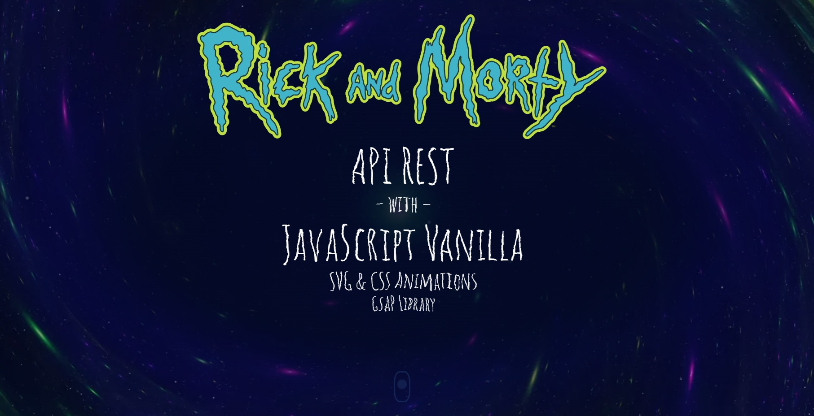
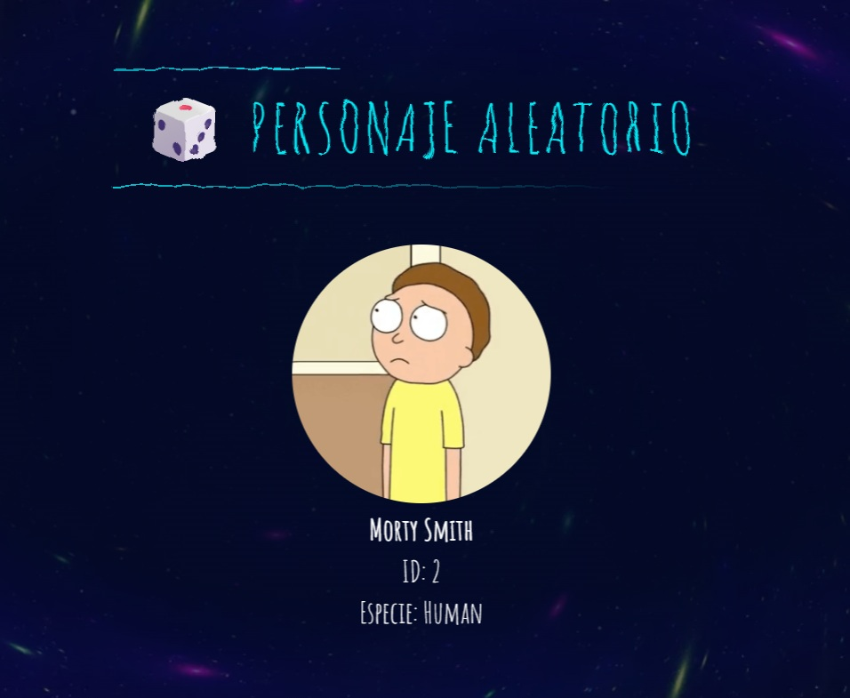

# Rick and Morty - API, SVG & CSS Animations

Proyecto Front-End para consumo de API REST pública desarrollado con **JavaScript Vainilla** (ECMAScript nativo).

LINK AL SITIO: https://javieraquattrucci.github.io/Rick-y-Morty-API-Animate/ 

Implementa una navegación de scroll horizontal gestionada por hardware a través de **GSAP** y micro-interacciones mediante animaciones de **CSS** optimizadas (`will-change`, `transform: translate3d`).

 El flujo de datos consume la **REST API** pública mediante la **Rick y Morty API**, abstrayendo las peticiones HTTP a través de un **fetch asincrónico** (`async/await`) con persistencia en memoria interna (caché) para optimizar la velocidad de carga. 

El sitio está estructurado en una portada y 3 secciones internas, integra función `Math.random()`.

## Instalación
Básica, no requiere Node.js 

## Atribuciones

### REST API y Datos
* **[The Rick and Morty API](https://rickandmortyapi.com/documentation#javascript-client)**

### Recursos Multimedia
* **[Wikimedia Commons](https://commons.wikimedia.org/wiki/File:Rick_and_Morty.svg)** - Vector oficial (SVG) 
* **[Colin Jones (Pexels)](https://www.pexels.com/es-es/video/video-en-bucle-de-neon-galaxy-twirl-35235775/)** - Video

El video utilizado para el fondo estelar lo he recortado, optimizado y formateado a webm, logrando así un peso menor a 1MB para un video original de 60MB

### Repositorios de Código y Prototipos (CodePen)
* **[Lucas Bebber](https://codepen.io/lbebber/pen/KwGEQv/)** 
* **[Captain Brosset](https://codepen.io/captainbrosset/pen/PwzvBGB)** 
* **[Kyon Jordan](https://codepen.io/Kyon-Jordan/pen/Yzbmedx)**

## Descargo de Responsabilidad (Disclaimer)

Este proyecto es de carácter educativo y sin fines de lucro. No está afiliado, asociado, autorizado, respaldado ni conectado oficialmente de ninguna manera con ninguno de sus canales oficiales. 

El uso de la marca e imágenes relacionados con "Rick y Morty" se realiza bajo los términos de uso de su API pública y con fines estrictamente ilustrativos y de demostración de habilidades de desarrollo de software. Todas las marcas comerciales y derechos de autor pertenecen a sus respectivos propietarios. 
